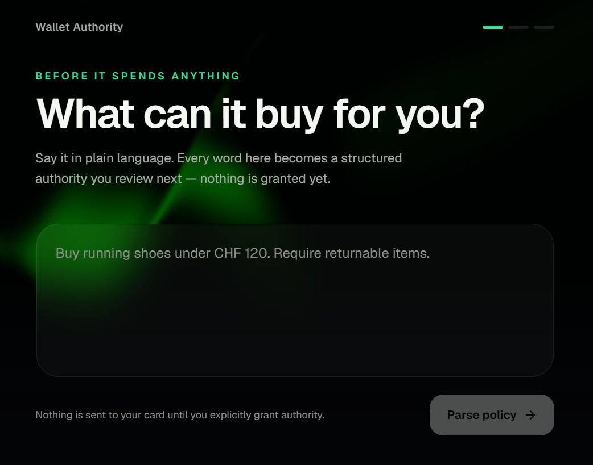
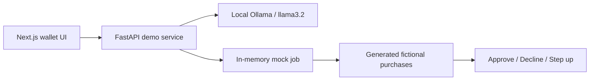

# Leash — Guardrails for Agentic Commerce

Leash is a hackathon prototype for keeping customers in control when an AI shopping agent can spend on their behalf. A customer describes purchasing rules in plain language, reviews the extracted authority, and sees each generated purchase approved, declined, or escalated for human review with an auditable reason.

This public portfolio version uses only fictional data and a local transaction simulator. It contains no sponsor dataset, credentials, private endpoints, or real payment activity.



## Demo flow

1. **Describe authority** — enter a request such as “Buy running shoes under CHF 120. Require returnable items.”
2. **Extract policy locally** — Ollama converts the text into typed products, quantities, limits, currency, merchant restrictions, and order terms.
3. **Review before granting** — missing or incorrect fields remain editable; parsing alone grants no spending authority.
4. **Confirm authority** — the FastAPI service validates the reviewed policy and creates an in-memory demo job.
5. **Inspect decisions** — three fictional purchases demonstrate approval, decline, and step-up, including the evidence behind each result.
6. **Resolve uncertainty** — the customer can approve or decline a transaction that needs human review.

## Why it exists

AI shopping agents need more than fraud detection. They must respect the customer’s intent, spending limits, merchant restrictions, and order requirements while treating merchant-controlled text as untrusted evidence rather than instructions.

Leash demonstrates a control layer with three outcomes:

- **Approve** when every required rule is satisfied.
- **Decline** when a hard rule is violated.
- **Step up** when an important fact is unknown and the customer must decide.

## Public demo architecture



Ollama extracts a structured policy from natural-language instructions. The mock service then generates a stable three-purchase demonstration from the confirmed policy. It never contacts a cloud model, payment system, or sponsor API.

Ollama is used only for interpreting the customer’s initial instructions. In this public version, the three purchase outcomes are generated deterministically from the confirmed limit; the model is never used to decide whether a purchase should be approved.

## Public/private boundary

This repository intentionally separates the reusable prototype from the private hackathon integration:

- Included: frontend, local Ollama extraction, policy validation, fictional purchase generation, decision evidence, and step-up resolution.
- Excluded: Viseca datasets, private endpoints, credentials, internal API schemas, and real customer or payment information.
- The generated merchant names, transactions, identifiers, amounts, and decision evidence are fictional.

## Technology

- Next.js 16, React 19, TypeScript, Tailwind CSS
- Motion, GSAP, and OGL for interface transitions
- FastAPI and Pydantic for the local demo API
- Ollama with `llama3.2` for local structured policy extraction
- Pytest for backend and API-flow tests

## Run locally

Prerequisites: Node.js, Python 3.11 or newer, and [Ollama](https://ollama.com/).

### 1. Start Ollama

Download the model once, then ensure Ollama is running:

```bash
ollama pull llama3.2
ollama serve
```

If the Ollama desktop application already runs the service, `ollama serve` is unnecessary. No API key is required.

### 2. Start the backend

From the project root on Windows PowerShell:

```powershell
cd backend
python -m venv .venv
.\.venv\Scripts\Activate.ps1
python -m pip install -r requirements.txt
uvicorn main:app --reload --port 8000
```

On macOS or Linux, use `source .venv/bin/activate` instead of the PowerShell activation command.

### 3. Start the frontend

In another terminal, from the project root:

```bash
npm install
npm run dev
```

Open [http://localhost:3000](http://localhost:3000). The backend API documentation is available at [http://localhost:8000/docs](http://localhost:8000/docs).

## Configuration

No `.env` file is required for the default local setup.

`NEXT_PUBLIC_API_URL` is not required for local development because the frontend defaults to `http://localhost:8000`. Set it only when the backend runs at another address.

The backend defaults to `http://localhost:11434/v1` and model `llama3.2`. Advanced users can override these with `OLLAMA_BASE_URL` and `OLLAMA_MODEL`; neither is required for the default setup.

The backend uses the OpenAI-compatible protocol exposed by Ollama. Its hard-coded `ollama-local` client value only satisfies the SDK’s non-empty API-key parameter; Ollama ignores it and it is not a credential.

## Repository structure

```text
app/                    Next.js pages and user flow
components/             Reusable interface and presentation components
lib/                    Public frontend contract and utilities
backend/main.py         FastAPI routes and Ollama policy extraction
backend/policy_prompt.py Structured extraction prompt and deterministic guards
backend/mock_jobs.py    In-memory fictional transactions and decisions
backend/test_*.py       Backend unit and API-flow tests
docs/                   README media
```

## Demo API

| Method | Route | Purpose |
| --- | --- | --- |
| `POST` | `/parse-policy` | Produce an editable structured policy draft using the local Ollama model. |
| `POST` | `/mock/jobs/prepare` | Validate a policy and prepare an in-memory demo job. |
| `POST` | `/mock/jobs/{job_id}/confirm` | Generate three fictional purchase decisions. |
| `GET` | `/mock/jobs/{job_id}` | Read the current demo state. |
| `POST` | `/mock/jobs/{job_id}/transactions/{transaction_id}/resolve` | Resolve a pending human-review decision. |

## Verification

Frontend:

```bash
npm run lint
npm run build
```

Backend:

```bash
cd backend
python -m pytest
```

The backend tests cover prompt guards, policy normalization, mock-job generation, all three decision outcomes, API responses, and customer resolution. The Ollama boundary is mocked during automated tests, so the test suite remains repeatable and does not download a model.

## Prototype limitations

- Jobs are stored in memory and disappear when the backend restarts.
- Local-model output can be imperfect, so the customer must review extracted rules before confirming.
- Transactions are generated for demonstration; this repository does not process payments.
- The project is not production-ready financial software.

## Origin and team

Built as an independent prototype for Viseca’s [**Agent on a Leash** case](https://starthack.eu/#/case-details?id=43) at START Hack Tour St. Gallen 2026.

- Yorian Melki — team lead
- Giannis Tsagkaropoulos — frontend
- Florian Gedeon — backend and security
- Jafar Sadig — mandate generation

Viseca and START Hack names and trademarks belong to their respective owners. This repository is not an official Viseca product and is not endorsed by Viseca.

## License

The team’s original code in this sanitized repository is available under the [MIT License](LICENSE). Sponsor datasets, APIs, documentation, and trademarks are not included or licensed.
