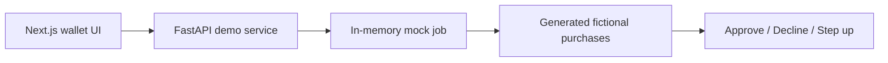

# Leash — Guardrails for Agentic Commerce

Leash is a hackathon prototype for keeping customers in control when an AI shopping agent can spend on their behalf. A customer describes purchasing rules in plain language, reviews the extracted authority, and sees each generated purchase approved, declined, or escalated for human review with an auditable reason.

This public portfolio version uses only fictional data and a local mock API. It contains no sponsor dataset, credentials, private endpoints, or real payment activity.

## Why it exists

AI shopping agents need more than fraud detection. They must respect the customer’s intent, spending limits, merchant restrictions, and order requirements while treating merchant-controlled text as untrusted evidence rather than instructions.

Leash demonstrates a control layer with three outcomes:

- **Approve** when every required rule is satisfied.
- **Decline** when a hard rule is violated.
- **Step up** when an important fact is unknown and the customer must decide.

## Public demo architecture



The mock service generates a stable three-purchase demonstration from the confirmed policy. It never contacts an external payment or sponsor API.

## Technology

- Next.js 16, React 19, TypeScript, Tailwind CSS
- Motion, GSAP, and OGL for interface transitions
- FastAPI and Pydantic for the local demo API
- Pytest for backend and API-flow tests

## Run locally

### Frontend

```bash
npm install
npm run dev
```

Open [http://localhost:3000](http://localhost:3000).

### Backend

From the project root on Windows PowerShell:

```powershell
cd backend
python -m venv .venv
.\.venv\Scripts\Activate.ps1
python -m pip install -r requirements.txt
uvicorn main:app --reload --port 8000
```

On macOS or Linux, activate the environment with:

```bash
source .venv/bin/activate
```

`NEXT_PUBLIC_API_URL` is not required for local development because the frontend defaults to `http://localhost:8000`. Set it only when the backend runs at another address.

## Demo API

| Method | Route | Purpose |
| --- | --- | --- |
| `POST` | `/parse-policy` | Produce an editable policy draft using the local deterministic demo parser. |
| `POST` | `/mock/jobs/prepare` | Validate a policy and prepare an in-memory demo job. |
| `POST` | `/mock/jobs/{job_id}/confirm` | Generate three fictional purchase decisions. |
| `GET` | `/mock/jobs/{job_id}` | Read the current demo state. |
| `POST` | `/mock/jobs/{job_id}/transactions/{transaction_id}/resolve` | Resolve a pending human-review decision. |

Interactive API documentation is available at [http://localhost:8000/docs](http://localhost:8000/docs) while the backend is running.

## Verification

Frontend:

```bash
npm run lint
npm run build
```

Backend:

```bash
cd backend
python -m pytest
```

The backend tests cover policy normalization, mock-job generation, all three decision outcomes, API responses, and customer resolution.

## Prototype limitations

- Jobs are stored in memory and disappear when the backend restarts.
- The public parser intentionally supports a limited vocabulary and expects the customer to review extracted rules.
- Transactions are generated for demonstration; this repository does not process payments.
- The project is not production-ready financial software.

## Origin and team

Built as an independent prototype for the Viseca **Agent on a Leash** case at START Hack Tour St. Gallen 2026.

- Yorian Melki — team lead
- Giannis Tsagkaropoulos — frontend
- Florian Gedeon — backend and security
- Jafar Sadig — mandate generation

Viseca and START Hack names and trademarks belong to their respective owners. This repository is not an official Viseca product and is not endorsed by Viseca.

## License

The team’s original code in this sanitized repository is available under the [MIT License](LICENSE). Sponsor datasets, APIs, documentation, and trademarks are not included or licensed.
